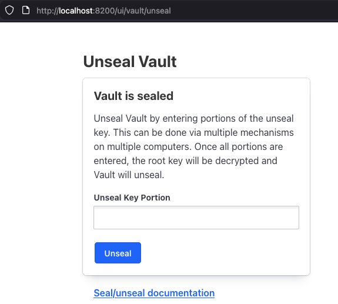
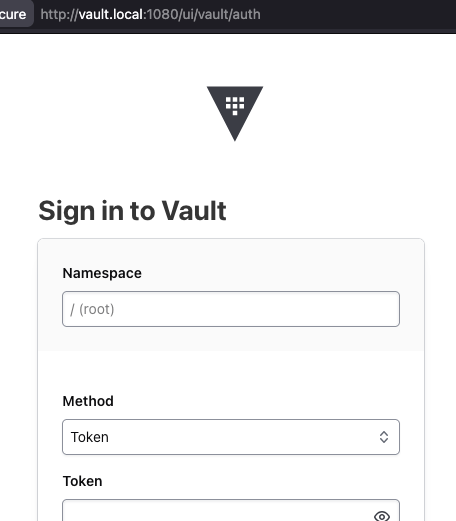

# docker-vault-lb
The purpose of this repo is to help the Vault UI team to reproduce the issue when CSP is set and direct access to node's UI redirects to "Vault is sealed" page.

## TLDR
If you have everything correctly configured, including the hostfile, you can run :

```bash
task all
```

| URL | Type of access | Page displayed |
| -------- | ------- | ------- |
| http://localhost:8200/ui | Direct to node | Vault is sealed |
| http://vault.local:1080/ui | From LB (nginx) | Vault login |


## Why this repo ?

Configuring `Content-Security-Policy` via the `custom_response_headers` stanza can cause unexpected behavior.

```bash
# In the listener section
  custom_response_headers {
    "default" = {
      "Content-Security-Policy" = ["connect-src http://vault.local:1080"]
    }
  }
```

Direct access to a node's UI may redirect to the 'Vault is sealed' page, whereas accessing the UI via the Load Balancer correctly displays the login page.





## Prerequisites

**Required Tools:**
```bash
# Install task runner and jq
brew install go-task jq

# Install Vault CLI
brew tap hashicorp/tap
brew install hashicorp/tap/vault

# Ensure you have Docker and Docker Compose
docker --version
docker compose version
```

**Clone Repository:**
```bash
git clone https://github.com/hashimiche/docker-vault-lb.git
cd docker-vault-lb
```

**Environment Configuration:**
Configure `.env` :
1. Add your Vault Enterprise license to `VAULT_LICENSE`
2. `VAULT_ADDR` is pre-configured as `http://localhost:8200`
3. For conveniency, `VAULT_TOKEN` can also be exported


## Taskfile

While `task all` is convenient, it only works during the first run, you can find the description of the others commands below.

```bash
# 1. Start the complete stack
task up

# 2. Initialize Vault (first time only)
task init

# 3. Unseal Vault
task unseal

# 4. Restart Vault
task restart

# 5. Vault status
task status

# 6. Destroy the stack
task down
```

